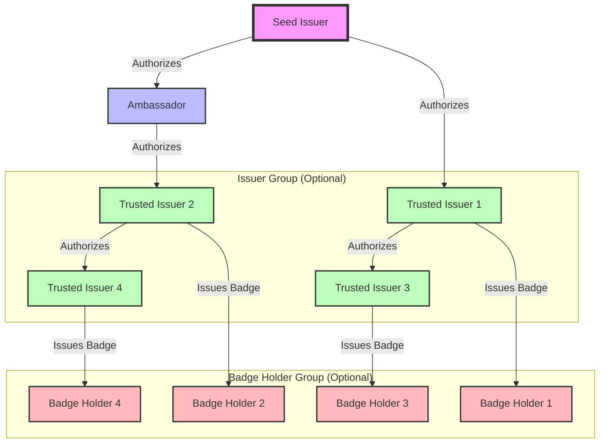

# NIP-XX: Web of Trusted Issuers using Badges, Lists, and Optional Groups

`draft` `optional`

This NIP defines a protocol for creating a Web of Trusted Issuers using Badges as credentials, building upon [NIP-58](https://github.com/nostr-protocol/nips/blob/master/58.md) (Badges), [NIP-51](https://github.com/nostr-protocol/nips/blob/master/51.md) (Lists), and optionally [NIP-29](https://github.com/nostr-protocol/nips/blob/master/29.md) (Relay-based Groups).

## Abstract

This NIP introduces a system for creating a decentralized Web of Trusted Issuers using Badges as credentials, Lists for managing badge-related information, and optional Groups for organizing issuers and badge holders. It defines new event kinds and conventions for establishing trust relationships between issuers, creating a hierarchical trust structure, and using badges as verifiable credentials within the Nostr ecosystem.

## Motivation

The goal of this NIP is to provide a decentralized and privacy-preserving way to establish trust relationships between different entities in the Nostr ecosystem. By leveraging existing NIPs and introducing new event kinds and list types, we can create a Web of Trusted Issuers that can be used for various purposes, such as:

1. Identity verification
2. Reputation management
3. Access control
4. Decentralized credentialing
5. Community building and engagement
6. Hierarchical trust structures for different domains or purposes

This system allows for the creation of flexible trust networks that can scale to various sizes and complexities while maintaining the core principles of Nostr.

## Definitions

1. **Seed Issuer**: The root of trust in the system, typically a well-known and trusted entity or a group of entities.
2. **Ambassador** (Optional): An entity authorized by the Seed Issuer to authorize Trusted Issuers.
3. **Trusted Issuer**: An entity authorized by the Seed Issuer, an Ambassador (if implemented), or another Trusted Issuer to issue badges.
4. **Badge Holder**: A user who has been awarded a badge by a Trusted Issuer.
5. **Issuer Group** (Optional): A relay-based group that consists of Trusted Issuers for a specific domain or purpose.
6. **Badge Holder Group** (Optional): A relay-based group that consists of users who hold a specific type of badge.

## New Event Kinds

This NIP introduces the following new event kinds:

1. **Seed Issuer Declaration**: Kind `31000`
2. **Ambassador Authorization** (Optional): Kind `31001`
3. **Trusted Issuer Authorization**: Kind `31002`
4. **Issuer Group Creation** (Optional): Kind `31003`
5. **Badge Holder Group Creation** (Optional): Kind `31004`

### Seed Issuer Declaration (Kind 31000)

This event is used to declare a Seed Issuer. It should be a parameterized replaceable event with a `d` tag containing a unique identifier for the Seed Issuer.

Required tags:
- `d`: A unique identifier for the Seed Issuer
- `name`: The name of the Seed Issuer

Optional tags:
- `description`: A description of the Seed Issuer's purpose and scope
- `website`: The official website of the Seed Issuer
- `image`: An image URL representing the Seed Issuer

### Ambassador Authorization (Kind 31001) - Optional

This event is used by the Seed Issuer to authorize Ambassadors. It should reference the Seed Issuer Declaration event and the public key of the authorized Ambassador.

Required tags:
- `e`: The event ID of the Seed Issuer Declaration
- `p`: The public key of the authorized Ambassador
- `exp`: The expiration date of the authorization (Unix timestamp)

Optional tags:
- `description`: A description of the Ambassador's role and responsibilities

### Trusted Issuer Authorization (Kind 31002)

This event is used by the Seed Issuer, Ambassadors (if implemented), or other Trusted Issuers to authorize new Trusted Issuers. It should reference the authorizing entity's event and the public key of the newly authorized Trusted Issuer.

Required tags:
- `e`: The event ID of the authorizing entity's event (Seed Issuer Declaration, Ambassador Authorization, or another Trusted Issuer Authorization)
- `p`: The public key of the newly authorized Trusted Issuer
- `exp`: The expiration date of the authorization (Unix timestamp)

Optional tags:
- `description`: A description of the Trusted Issuer's role and responsibilities
- `scope`: A list of badge types the Trusted Issuer is authorized to issue

### Issuer Group Creation (Kind 31003) - Optional

This event is used to create a new Issuer Group. It should be a parameterized replaceable event with a `d` tag containing a unique identifier for the Issuer Group.

Required tags:
- `d`: A unique identifier for the Issuer Group
- `name`: The name of the Issuer Group
- `h`: The group ID as defined in NIP-29

Optional tags:
- `description`: A description of the Issuer Group's purpose and scope
- `image`: An image URL representing the Issuer Group

### Badge Holder Group Creation (Kind 31004) - Optional

This event is used to create a new Badge Holder Group. It should be a parameterized replaceable event with a `d` tag containing a unique identifier for the Badge Holder Group.

Required tags:
- `d`: A unique identifier for the Badge Holder Group
- `name`: The name of the Badge Holder Group
- `h`: The group ID as defined in NIP-29
- `e`: The event ID of the Badge Definition this group is associated with

Optional tags:
- `description`: A description of the Badge Holder Group's purpose and scope
- `image`: An image URL representing the Badge Holder Group

## New List and Set Types

Building upon NIP-51, we introduce the following new list and set types to manage badge-related information:

### Standard Lists

| name              | kind  | description                                                 | expected tag items                                                                |
| ---               | ---   | ---                                                         | ---                                                                               |
| Awarded Users     | 10010 | Users who have been awarded badges by the issuer            | `"p"` (pubkeys), `"e"` (Badge Award events)                                       |
| Revoked Badges    | 10011 | Badges that have been revoked by the issuer                 | `"e"` (Badge Award events)                                                        |

### Sets

| name              | kind  | description                                                 | expected tag items                                                                |
| ---               | ---   | ---                                                         | ---                                                                               |
| Badge Issuance Sets | 30010 | Sets of badge types an issuer is authorized to issue      | `"e"` (Badge Definition events), `"a"` (Badge Definition identifiers)             |
| Trust Chain Sets    | 30011 | Sets representing trust chains for verification           | `"e"` (Trusted Issuer Authorization events)                                       |

## Ambassador Role: Pros and Cons

The Ambassador role is optional in this proposal, allowing implementers to choose whether to include it based on their specific needs. Here are some pros and cons of including the Ambassador role:

Pros:
1. Scalability: Ambassadors can help manage larger trust networks by delegating the authority to authorize Trusted Issuers.
2. Specialization: Ambassadors can focus on specific domains or regions, allowing for more targeted trust management.
3. Flexibility: The inclusion of Ambassadors allows for a more complex and adaptable trust structure.

Cons:
1. Complexity: Adding the Ambassador role increases the complexity of the trust network and verification process.
2. Potential for abuse: If not properly managed, Ambassadors could become points of failure or abuse in the trust network.
3. Overhead: For smaller networks, the Ambassador role may introduce unnecessary overhead.

Implementers should carefully consider whether to include the Ambassador role based on the anticipated size and complexity of their trust network. For smaller networks, a two-level hierarchy (Seed Issuer and Trusted Issuers) may be sufficient.

## Optional Integration with Relay-based Groups

The Web of Trusted Issuers system can optionally leverage relay-based groups as defined in NIP-29 to organize issuers and badge holders. This integration provides the following benefits:

1. **Issuer Collaboration**: Trusted Issuers can communicate and collaborate within Issuer Groups, sharing best practices and discussing badge issuance policies.
2. **Badge Holder Communities**: Badge holders can join Badge Holder Groups associated with their badges, fostering community engagement and allowing for badge-specific discussions.
3. **Moderation and Governance**: The moderation capabilities of relay-based groups can be used to manage Issuer and Badge Holder Groups, ensuring proper governance of the trust network.

Implementers can choose whether to incorporate groups based on their specific use cases and desired level of community engagement.

## Trust Chain Verification

To verify the validity of a badge within the Web of Trusted Issuers system, clients should follow these steps:

1. Verify the Badge Award event (Kind 8) by checking its signature and the referenced Badge Definition event.
2. Check the Awarded Users List (Kind 10010) to confirm the badge holder is listed.
3. Ensure the badge is not in the Revoked Badges List (Kind 10011).
4. Verify the Badge Definition event (Kind 30009) by checking its signature and the referenced Trusted Issuer Authorization event.
5. Check the Badge Issuance Set (Kind 30010) to confirm the issuer is authorized to issue this badge type.
6. Use the Trust Chain Set (Kind 30011) to verify the complete chain of trust up to the Seed Issuer, including Ambassador Authorization (if implemented) and other Trusted Issuer Authorizations in the chain.
7. Optionally, check if the badge holder is a member of the corresponding Badge Holder Group (Kind 31004).
8. Optionally, verify that the badge issuer is a member of an appropriate Issuer Group (Kind 31003).

Clients MAY implement caching mechanisms to improve the efficiency of trust chain verification.

## Implementation Recommendations

1. Clients should provide user interfaces for managing and displaying trust relationships, credentials, and lists.
2. Relays may choose to implement specialized filtering and querying capabilities to efficiently retrieve and validate trust chains and badge-related information.
3. Issuers should regularly update their lists and sets to maintain accurate and up-to-date information about badge holders and their authorization scopes.
4. Implementers should carefully consider whether to include the Ambassador role and Groups integration based on the anticipated size and complexity of their trust network.
5. If using Groups, clients should implement the necessary features to interact with relay-based groups as defined in NIP-29, including support for the various event kinds (9, 10, 11, 12, 9021, 9022, and 9000-9020).

## Conclusion

This NIP provides a flexible framework for creating a Web of Trusted Issuers using Badges as credentials within the Nostr ecosystem. By introducing optional Ambassador roles and Groups integration, and leveraging existing NIPs, it enables the creation of decentralized trust networks that can scale to various sizes and complexities while maintaining the core principles of Nostr. Implementers can choose to use or omit certain features based on their specific needs, allowing for adaptability to different use cases and network sizes.

## Diagram

